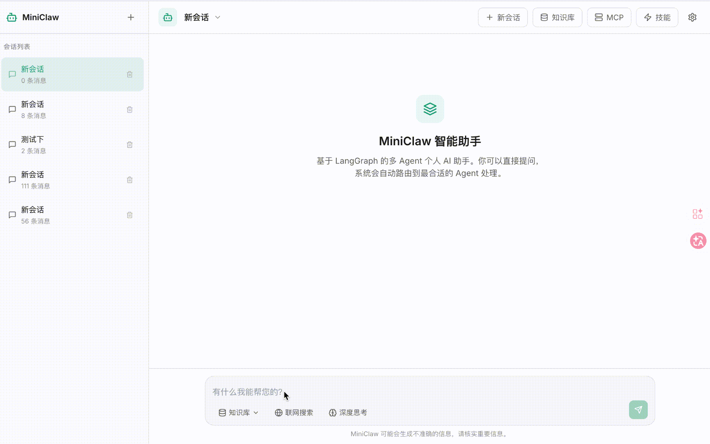
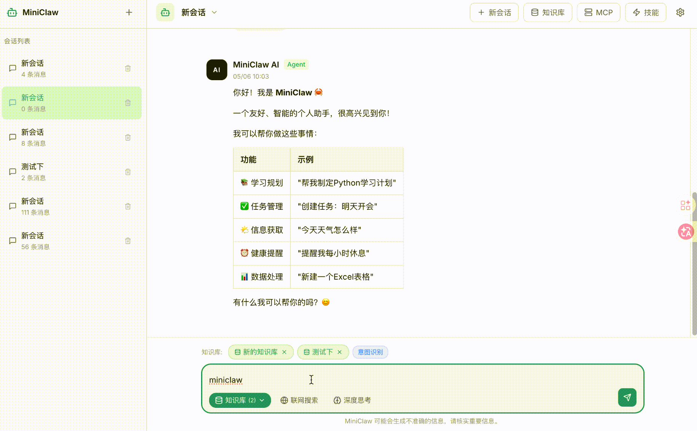
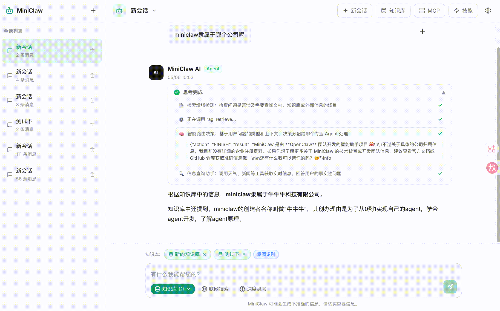
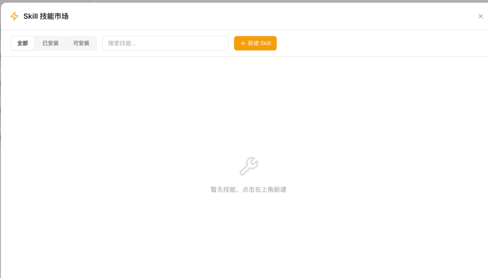
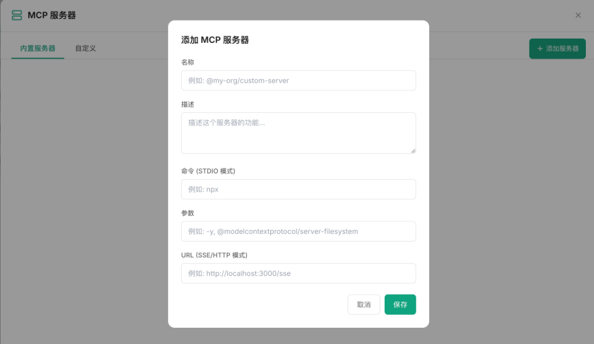

<div align="center">
  
  <h1>MiniClaw</h1>
  <p>エンタープライズグレードのマルチエージェントAIアシスタントプラットフォーム。LangGraphマルチエージェントアーキテクチャとLangChainエコシステムをベースに構築されており、ディープシンキング、ウェブ検索、ナレッジベースRAG、MCPプロトコル拡張、Skillシステムなどの高度な機能をサポートしています。</p>
</div>

[English](README_EN.md) | [中文](README.md) | **日本語** | [한국어](README_KR.md)

## 機能プレビュー

### インテリジェントチャットホームページ

LangGraphマルチエージェントアーキテクチャに基づくインテリジェントな対話インターフェース。ストリーミングレスポンス、マルチセッション管理、ディープシンキングとウェブ検索のワンクリック切り替えをサポートします。



### ナレッジベース選択

対話中に複数のナレッジベースを参照ソースとして手動選択可能。**意図認識**（検索が必要か自動判断）と**強制検索**の両モードをサポートします。



### ナレッジベース管理

エンタープライズグレードのナレッジベース管理。埋め込みモデル、次元、チャンキング戦略をカスタマイズ可能。ドラッグ＆ドロップでドキュメントをアップロードし、解析→チャンキング→ベクトル化→保存の全自動パイプラインを実行します。



### Skill機能拡張

SKILL.md宣言型設定に基づくSkillマーケットプレイス。条件付きツール注入をサポートし、Agentの能力を自由に拡張できます。



### MCPサーバー拡張

Model Context Protocol (MCP) をサポートし、外部MCPサーバーに接続して無限のツール能力を拡張できます。



---

## コア機能

### マルチエージェント連携システム

- **Supervisor-Workerアーキテクチャ** - LangGraphのスーパーバイザー・エグゼキュータパターンをベースに、Supervisorがタスクルーティングを担当し、Workerが専門領域の実行を担当
- **6つの専門エージェント** - Chat（対話）、Task（タスク）、Info（情報検索）、Learning（学習支援）、Health（健康相談）、Data（データ分析）
- **動的ツール注入** - Skill条件注入と強制ツール注入（ディープシンキング、ウェブ検索）をサポート

### ナレッジベースとRAG

- **エンタープライズグレードのナレッジベース管理** - ナレッジベースの作成、設定、削除をサポート。埋め込みモデル、リランキングモデル、チャンキング戦略を指定可能
- **ハイブリッド検索エンジン** - Denseベクトル検索 + BM25キーワード検索 + RRF融合アルゴリズム
- **複数ベクトルストレージバックエンド** - FAISS（ローカル）とMilvus（プロダクショングレード）
- **マルチフォーマットドキュメント対応** - PDF、Markdown、TXT、Wordなどのフォーマット解析とベクトル化
- **意図認識/強制検索** - 自動判定または強制的なナレッジベース検索をサポート

### ツールと拡張

- **MCPプロトコル対応** - Model Context Protocol、外部ツールやサービスとの連携
- **Skillシステム** - SKILL.md宣言型設定に基づく条件付きツール注入
- **強制ウェブ検索** - Tavily API / DuckDuckGoのデュアルバックエンド、プログラマティックな事前実行検索
- **ディープシンキングモード** - thinkツールの強制呼び出しによる構造化推論
- **内蔵ツールセット** - 天気検索、ニュース取得、リマインダー管理、Excel処理など

### フロントエンドインタラクション

- **Next.js 14 + React** - モダンなフロントエンドアーキテクチャ
- **ストリーミングレスポンス** - SSEリアルタイム出力、思考過程の可視化をサポート
- **ナレッジベース管理UI** - ドラッグ＆ドロップアップロード、設定管理、検索モード切り替え
- **マルチセッション管理** - セッション作成、リネーム、履歴管理

## ビジネスアーキテクチャ

```
┌─────────────────────────────────────────────────────────────────────────────┐
│                              ユーザーインタラクションレイヤー                  │
│  ┌─────────────┐  ┌─────────────┐  ┌─────────────┐  ┌─────────────────────┐ │
│  │  チャットUI  │  │  ナレッジ    │  │  セッション  │  │   エージェント設定   │ │
│  │ ChatPanel   │  │  KB Panel   │  │  Session    │  │   Settings Panel    │ │
│  └──────┬──────┘  └──────┬──────┘  └──────┬──────┘  └──────────┬──────────┘ │
│         └─────────────────┴─────────────────┴────────────────────┘            │
│                                    │                                         │
│                              HTTP / SSE                                      │
└────────────────────────────────────┼─────────────────────────────────────────┘
                                     │
┌────────────────────────────────────┼─────────────────────────────────────────┐
│                              APIゲートウェイレイヤー                          │
│                                    │                                         │
│  ┌─────────────────────────────────┴─────────────────────────────────────┐   │
│  │                    FastAPI RESTful API                                  │   │
│  │  /chat/stream  /chat  /knowledge-bases  /sessions  /tools  /mcp       │   │
│  └─────────────────────────────────┬─────────────────────────────────────┘   │
│                                    │                                         │
└────────────────────────────────────┼─────────────────────────────────────────┘
                                     │
┌────────────────────────────────────┼─────────────────────────────────────────┐
│                           LangGraphワークフローエンジン                       │
│                                    │                                         │
│  ┌─────────────────────────────────┴─────────────────────────────────────┐   │
│  │                         Supervisorルーティングノード                     │   │
│  │  入力: ユーザーメッセージ + metadata(force_think, force_search, selected_kbs)│
│  │  出力: Command(goto=WorkerType)                                        │   │
│  └─────────────┬─────────────┬─────────────┬─────────────┬───────────────┘   │
│                │             │             │             │                  │
│         ┌──────┘      ┌──────┘      ┌──────┘      ┌──────┘                  │
│         ▼             ▼             ▼             ▼                          │
│  ┌──────────┐  ┌──────────┐  ┌──────────┐  ┌──────────┐                     │
│  │  Chat    │  │  Info    │  │  Task    │  │ Learning │  ...                │
│  │  Agent   │  │  Agent   │  │  Agent   │  │  Agent   │                     │
│  └────┬─────┘  └────┬─────┘  └────┬─────┘  └────┬─────┘                     │
│       │             │             │             │                            │
│       └─────────────┴─────────────┴─────────────┘                            │
│                     │                                                        │
│              ┌──────┴──────┐                                                 │
│              ▼             ▼                                                 │
│  ┌─────────────────┐  ┌─────────────────┐                                    │
│  │   RAG Node      │  │   Tool Call     │                                    │
│  │ (ナレッジ検索)   │  │ (ツール実行)     │                                    │
│  └─────────────────┘  └─────────────────┘                                    │
│                                                                              │
└──────────────────────────────────────────────────────────────────────────────┘
                                     │
┌────────────────────────────────────┼─────────────────────────────────────────┐
│                              機能拡張レイヤー                                 │
│                                    │                                         │
│  ┌─────────────────────────────────┼─────────────────────────────────────┐   │
│  │         Skillシステム             │         MCPプロトコル拡張            │   │
│  │  ┌─────────────────────────┐    │    ┌─────────────────────────┐     │   │
│  │  │  SKILL.md 宣言型設定     │    │    │  MCP Server 接続管理     │     │   │
│  │  │  - agent バインディング  │    │    │  - STDIO / SSE 転送      │     │   │
│  │  │  - tools 条件注入        │    │    │  - ツール発見と呼び出し   │     │   │
│  │  │  - condition トリガー条件│    │    │  - OAuth 認証            │     │   │
│  │  └─────────────────────────┘    │    └─────────────────────────┘     │   │
│  └─────────────────────────────────┴─────────────────────────────────────┘   │
│                                                                              │
└──────────────────────────────────────────────────────────────────────────────┘
                                     │
┌────────────────────────────────────┼─────────────────────────────────────────┐
│                              インフラストラクチャレイヤー                     │
│                                    │                                         │
│  ┌─────────────┐  ┌─────────────┐  ┌─────────────┐  ┌─────────────────────┐ │
│  │  Embedding  │  │  VectorStore│  │    LLM      │  │   Memory/Persistence│ │
│  │  (Ollama/   │  │  (FAISS/    │  │ (Ollama/    │  │   (MemorySaver/     │ │
│  │   OpenAI/   │  │   Milvus)   │  │  OpenAI/    │  │    FileSystem)      │ │
│  │   HF)       │  │             │  │  DeepSeek)  │  │                     │ │
│  └─────────────┘  └─────────────┘  └─────────────┘  └─────────────────────┘ │
│                                                                              │
└──────────────────────────────────────────────────────────────────────────────┘
```

## 技術アーキテクチャ

### バックエンドアーキテクチャ

```
src/miniclaw/
├── agents/                    # マルチエージェントシステム
│   ├── supervisor.py          # Supervisor Agent - タスクルーティングと配布
│   ├── worker.py              # BaseWorker - Worker基底クラス、ツール注入と実行
│   ├── chat.py                # Chat Agent - 汎用対話
│   ├── info.py                # Info Agent - 情報検索（天気、ニュース、RAG）
│   ├── task.py                # Task Agent - タスク管理
│   ├── learning.py            # Learning Agent - 学習支援
│   ├── health.py              # Health Agent - 健康相談
│   ├── data.py                # Data Agent - データ分析
│   └── base.py                # Agent基底クラス定義
│
├── core/                      # コアエンジン
│   ├── graph.py               # LangGraphワークフロー定義（MiniClawApp）
│   ├── state.py               # 状態定義（MiniClawState）
│   ├── router.py              # ルーティングロジック
│   ├── error_handler.py       # エラーハンドリングとリトライ
│   └── exceptions.py          # 例外定義
│
├── rag/                       # RAG検索拡張システム
│   ├── service.py             # RAGService - ナレッジベース管理と検索エントリ
│   ├── vectorstore.py         # FAISS/Milvusベクトルストレージ実装
│   ├── embeddings.py          # Embeddingサービス（Ollama/OpenAI/HF）
│   ├── retriever.py           # HybridRetriever - ハイブリッド検索（Dense+BM25+RRF）
│   ├── rag_node.py            # LangGraph RAGノード（detect/retrieve/generate）
│   ├── rag_tools.py           # RAGツール（rag_searchなど）
│   ├── document_loader.py     # ドキュメント読み込みと解析
│   ├── chunking.py            # ドキュメントチャンキング戦略
│   └── knowledge_manager.py   # ナレッジベース管理
│
├── skills/                    # Skillシステム
│   ├── registry.py            # SkillRegistry - グローバルシングルトンレジストリ
│   ├── loader.py              # SkillLoader - SKILL.mdパーサー
│   └── builtin/               # 内蔵Skills
│       └── web_search/        # ウェブ検索Skill
│           └── SKILL.md       # 宣言型設定（agent/tools/condition）
│
├── mcp/                       # MCPプロトコル実装
│   ├── manager.py             # MCP接続管理
│   ├── client.py              # MCPクライアント
│   ├── tools.py               # MCPツール登録と発見
│   └── protocol.py            # MCPプロトコル定義
│
├── tools/                     # ツールセット
│   ├── tavily.py              # Tavilyウェブ検索
│   ├── think.py               # ディープシンキングツール
│   ├── weather.py             # 天気検索
│   ├── news.py                # ニュース取得
│   ├── reminder.py            # リマインダー管理
│   ├── scheduler.py           # スケジュールタスク
│   ├── excel.py               # Excel処理
│   └── builtin/               # 内蔵ツール
│
├── memory/                    # メモリーシステム
│   ├── short_term.py          # 短期記憶
│   ├── mid_term.py            # 中期記憶
│   ├── long_term.py           # 長期記憶
│   └── checkpointer.py        # 状態チェックポイント
│
├── config/                    # 設定管理
│   ├── settings.py            # グローバル設定（Pydantic Settings）
│   └── prompts/               # プロンプトテンプレート
│
└── api.py                     # FastAPIメインエントリ
```

### フロントエンドアーキテクチャ

```
frontend/src/
├── app/                       # Next.js App Router
│   ├── page.tsx               # メインページ
│   └── layout.tsx             # ルートレイアウト
│
├── components/
│   ├── chat/                  # チャットコンポーネント
│   │   ├── ChatPanel.tsx      # チャットパネルメインコンポーネント
│   │   ├── ChatInput.tsx      # 入力ボックス（ツール切り替え、KB選択）
│   │   ├── ChatMessage.tsx    # メッセージレンダリング
│   │   ├── ThoughtChain.tsx   # 思考過程の可視化
│   │   └── RetrievalCard.tsx  # 検索結果カード
│   │
│   ├── knowledge/             # ナレッジベース管理
│   │   ├── KnowledgeBasePanel.tsx   # ナレッジベースグリッドリスト
│   │   ├── KbCreateModal.tsx        # ナレッジベース作成モーダル
│   │   └── KbDetailPanel.tsx        # ナレッジベース詳細（アップロード/管理）
│   │
│   ├── layout/                # レイアウトコンポーネント
│   │   ├── Navbar.tsx         # トップナビゲーション
│   │   ├── Sidebar.tsx        # サイドバー
│   │   └── ResizeHandle.tsx   # ドラッグによるサイズ調整
│   │
│   └── editor/                # エディタコンポーネント
│       └── InspectorPanel.tsx # インスペクタパネル
│
└── lib/
    ├── api.ts                 # APIクライアント（streamChatなど）
    └── store.tsx              # React Contextグローバル状態管理
```

## コアフロー

### 1. 強制ウェブ検索フロー

```
ユーザーが「ウェブ検索」ボタンをクリック
        │
        ▼
フロントエンド: forceSearch=true ─────────────────────────────┐
        │                                                     │
        ▼                                                     │
バックエンド stream():                                       │
  metadata.force_search=true                                   │
        │                                                     │
        ▼                                                     │
_worker._get_force_tools()                                     │
  → Skill条件注入: web_search Skill                          │
    → condition=force_search マッチ                          │
    → _load_tool_by_name("tavily")                            │
  → フォールバック注入: tavilyツール                          │
        │                                                     │
        ▼                                                     │
_execute_force_search() (プログラマティック事前実行)          │
  → 直接tavily(query)を呼び出し                              │
  → 結果をstate.force_search_contextに保存                    │
        │                                                     │
        ▼                                                     │
Agent.execute()                                                │
  → ツールバインディング (tavilyを含む)                       │
  → _build_force_prompt()                                      │
    → 「ユーザーがウェブ検索を有効化、検索結果を優先して回答」 │
  → LLM呼び出し                                               │
        │                                                     │
        ▼                                                     │
  ← 検索結果に基づく回答を返す ◄─────────────────────────────┘
```

### 2. ナレッジベースRAGフロー

```
ユーザーがナレッジベース「テスト」を選択 + 「miniclawとは何ですか」と質問
        │
        ▼
フロントエンド: selectedKbs=["テスト"], kbRetrievalMode="intent"
        │
        ▼
バックエンド stream():
  metadata.selected_kbs=["テスト"]
  metadata.kb_retrieval_mode="intent"
        │
        ▼
rag_detect_node():
  → 意図検出: RAGキーワードなし
  → しかしselected_kbsが存在 → 強制的にneeds_rag=True
        │
        ▼
should_retrieve() → "rag_retrieve"
        │
        ▼
rag_retrieve_node():
  → selected_kbsを読み込み
  → 「テスト」ナレッジベースを検索
  → rag_contextを返す
        │
        ▼
Agent.execute():
  → set_rag_tool_context(selected_kbs)
  → LLMがrag_searchツールを呼び出す
    → ツールがコンテキストを読み込み → 「テスト」を使用（デフォルトではない）
        │
        ▼
  ← ナレッジベース内容に基づく回答
```

### 3. Skillツール注入フロー

```
アプリケーション起動時:
  skill_registry.load_all(SkillLoader())
    → skills/builtin/*/SKILL.mdをスキャン
    → YAML frontmatterを解析
    → SkillRegistryに登録

エージェント実行時:
  _get_tools_from_skills(state)
    → skill_registry.get_for_agent(self.name)
    → Skill.toolsを反復処理:
      - conditionをチェック (force_search / force_think)
      - 条件がマッチ → _load_tool_by_name(tool_def.name)
        → _base_tools / MCPツール / 動的インポートを検索
    → ツールリストを返す

  _get_force_tools(state)
    → Skillツール + フォールバック注入
    → 最終的な強制ツールリストを返す
```

## インストールと設定

### 環境要件

- Python >= 3.10
- Node.js >= 18（フロントエンド）
- Ollama（ローカルモデル）または OpenAI/DeepSeek API Key

### バックエンドインストール

```bash
# プロジェクトをクローン
git clone <repository-url>
cd miniclaw

# 仮想環境を作成
python3 -m venv venv
source venv/bin/activate  # Linux/Mac

# 依存関係をインストール
pip install -e ".[dev]"
```

### フロントエンドインストール

```bash
cd frontend
npm install
npm run dev
```

### 設定

`.env`ファイルを作成：

```bash
# LLM設定（デフォルトはOllamaを使用）
LLM_PROVIDER=ollama
OLLAMA_BASE_URL=http://localhost:11434
OLLAMA_MODEL=qwen3:1.7b

# オプション: OpenAI設定
# OPENAI_API_KEY=your_openai_key
# OPENAI_MODEL=gpt-4o-mini

# オプション: DeepSeek設定
# DEEPSEEK_API_KEY=your_deepseek_key
# DEEPSEEK_MODEL=deepseek-chat

# Embedding設定
EMBEDDING_PROVIDER=ollama
EMBEDDING_MODEL=nomic-embed-text

# ウェブ検索設定
TAVILY_API_KEY=your_tavily_key  # オプション、未設定の場合はDuckDuckGoを使用

# 天気API
WEATHER_API_KEY=your_weatherapi_key

# ベクトルデータベース（オプション、デフォルトはFAISSを使用）
# MILVUS_HOST=localhost
# MILVUS_PORT=19530

# その他の設定
DEFAULT_CITY=Tokyo
LOG_LEVEL=INFO
```

## 使用方法

### CLIコマンド

```bash
# ヘルプを表示
miniclaw --help

# ディレクトリを初期化
miniclaw init

# LLM接続をテスト
miniclaw test-llm

# 単一メッセージの対話
miniclaw chat "こんにちは"

# インタラクティブ対話
miniclaw interactive

# Webサービスを起動
miniclaw serve
miniclaw serve --host 0.0.0.0 --port 9190 --reload
```

### Python API

```python
from miniclaw.core.graph import MiniClawApp

app = MiniClawApp()

# 通常の対話
response = await app.chat(
    message="今日の天気はどうですか？",
    user_id="user_001",
    session_id="session_001"
)

# 強制ウェブ検索
response = await app.chat(
    message="最新のAIニュース",
    force_search=True
)

# ナレッジベースを使用
response = await app.chat(
    message="miniclawとは何ですか？",
    selected_kbs=["テスト"],
    kb_retrieval_mode="force"
)

# ストリーミング出力
async for event in app.stream(
    message="こんにちは",
    force_think=True
):
    print(event)
```

### Web API

```bash
# ストリーミング対話
curl -X POST "http://localhost:9190/chat/stream" \
  -H "Content-Type: application/json" \
  -d '{
    "message": "こんにちは",
    "user_id": "user_001",
    "force_search": false,
    "force_think": false,
    "selected_kbs": ["テスト"],
    "kb_retrieval_mode": "intent"
  }'

# ナレッジベースを作成
curl -X POST "http://localhost:9190/knowledge-bases" \
  -H "Content-Type: application/json" \
  -d '{
    "name": "テスト",
    "description": "テストナレッジベース",
    "embedding_model": "bge-large-ja",
    "embedding_dimension": 1024,
    "similarity_threshold": 0.7
  }'

# ドキュメントをアップロード
curl -X POST "http://localhost:9190/knowledge-bases/テスト/upload" \
  -F "files=@document.pdf"
```

## 開発

```bash
# コードフォーマット
black src/
ruff check src/

# テストを実行
pytest tests/

# フロントエンド開発
cd frontend
npm run dev        # 開発サーバーを起動
npm run build      # プロダクションビルド
```

## 技術スタック

| レイヤー            | テクノロジー                              |
| ---------------- | ----------------------------------------- |
| **AIフレームワーク** | LangGraph, LangChain                      |
| **LLMサポート**    | Ollama, OpenAI, DeepSeek                  |
| **ベクトルストレージ** | FAISS, Milvus                             |
| **Embedding**    | Ollama Embeddings, OpenAI Embeddings, BGE |
| **Webフレームワーク** | FastAPI (バックエンド), Next.js 14 (フロントエンド) |
| **状態管理**      | LangGraph State, React Context            |
| **プロトコル拡張**      | MCP (Model Context Protocol)              |
| **デプロイ**        | Uvicorn, Node.js                          |

## ライセンス

MIT
