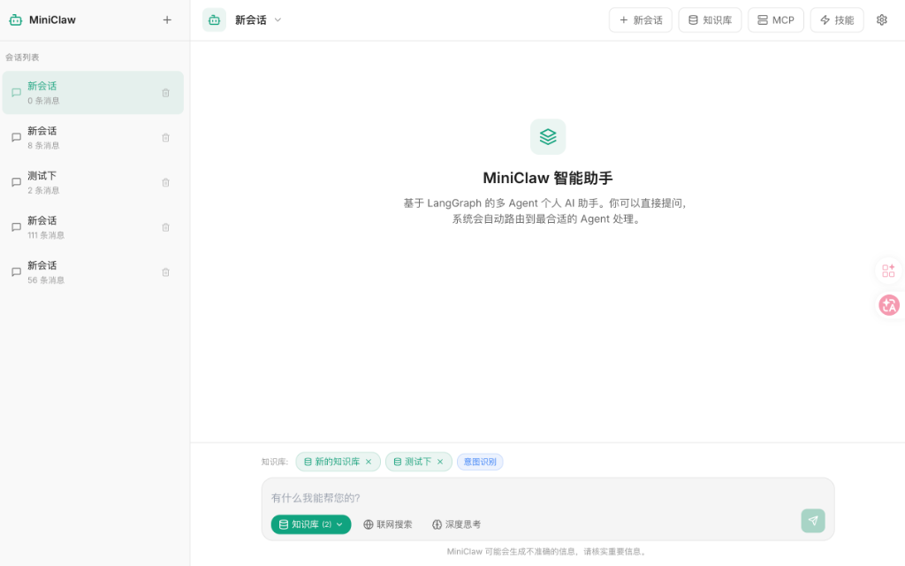
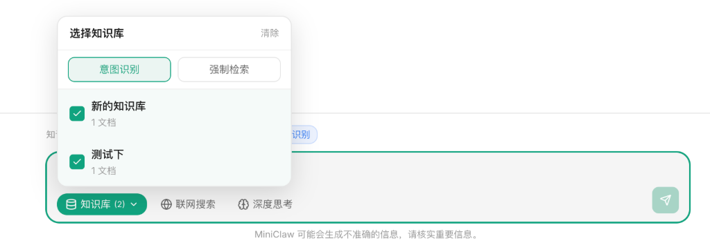
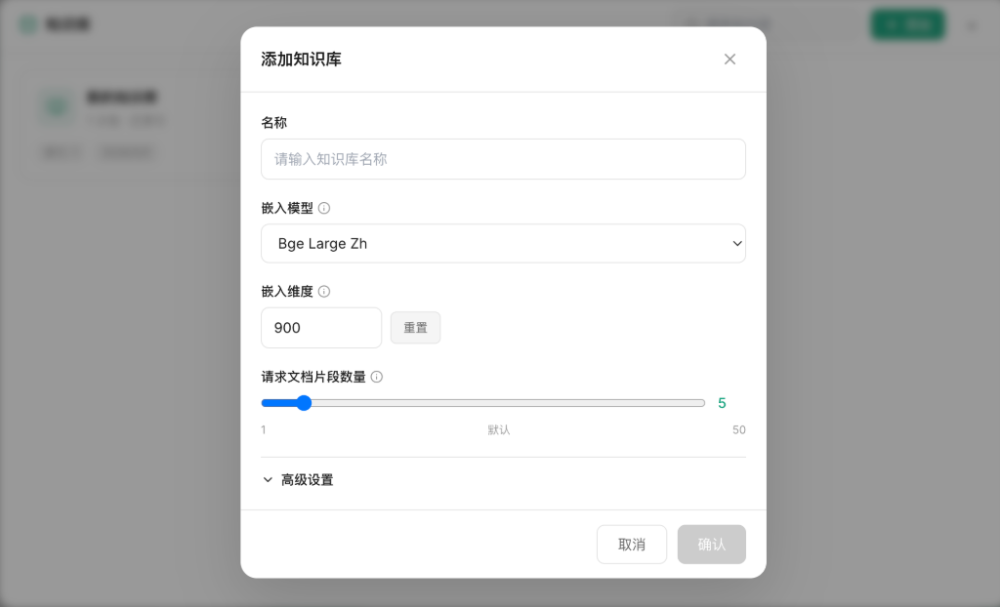

<div align="center">
  
  <h1>MiniClaw</h1>
  <p>엔터프라이즈급 멀티 에이전트 AI 어시스턴트 플랫폼입니다. LangGraph 멀티 에이전트 아키텍처와 LangChain 생태계를 기반으로 구축되었으며, 딥 씽킹, 웹 검색, 지식 기반 RAG, MCP 프로토콜 확장, Skill 시스템 등의 고급 기능을 지원합니다.</p>
</div>

[English](README_EN.md) | [中文](README.md) | [日本語](README_JP.md) | **한국어**

## 기능 미리보기

### 지능형 채팅 홈페이지

LangGraph 멀티 에이전트 아키텍처 기반의 지능형 대화 인터페이스로, 스트리밍 응답, 멀티 세션 관리, 딥 씽킹과 웹 검색 원클릭 전환을 지원합니다.



### 지식 기반 선택

대화 중 여러 지식 기반을 참조 소스로 수동 선택할 수 있으며, **의도 인식** (검색 필요 여부 자동 판단) 및 **강제 검색** 두 가지 모드를 지원합니다.



### 지식 기반 관리

엔터프라이즈급 지식 기반 관리로, 임베딩 모델, 차원, 청킹 전략을 사용자 지정할 수 있습니다. 드래그 앤 드롭으로 문서를 업로드하면 파싱→청킹→벡터화→저장 전체 파이프라인이 자동으로 실행됩니다.



### Skill 기능 확장

SKILL.md 선언형 설정 기반의 Skill 마켓플레이스로, 조걶 도구 주입을 지원하여 Agent의 능력을 자유롭게 확장할 수 있습니다.


### MCP 서버 확장

Model Context Protocol (MCP)을 지원하여 외부 MCP 서버에 연결하고 무한한 도구 기능을 확장할 수 있습니다.


---

## 핵심 기능

### 멀티 에이전트 협업 시스템

- **Supervisor-Worker 아키텍처** - LangGraph의 슈퍼바이저-실행자 패턴을 기반으로 Supervisor가 작업 라우팅을 담당하고 Worker가 전문 분야 실행을 담당합니다.
- **6개의 전문 에이전트** - Chat(대화), Task(작업), Info(정보 검색), Learning(학습 지원), Health(건강 상담), Data(데이터 분석)
- **동적 도구 주입** - Skill 조건 주입과 강제 도구 주입(딥 씽킹, 웹 검색)을 지원합니다.

### 지식 기반과 RAG

- **엔터프라이즈급 지식 기반 관리** - 지식 기반 생성, 설정, 삭제를 지원하며 임베딩 모델, 재정렬 모델, 청킹 전략을 지정할 수 있습니다.
- **하이브리드 검색 엔진** - Dense 벡터 검색 + BM25 키워드 검색 + RRF 융합 알고리즘
- **다중 벡터 스토리지 백엔드** - FAISS(로컬)와 Milvus(프로덕션급)
- **다중 포맷 문서 지원** - PDF, Markdown, TXT, Word 등의 포맷 파싱과 벡터화
- **의도 인식/강제 검색** - 자동 판단 또는 강제 지식 기반 검색을 지원합니다.

### 도구와 확장

- **MCP 프로토콜 지원** - Model Context Protocol, 외부 도구 및 서비스 연결
- **Skill 시스템** - SKILL.md 선언형 설정 기반 조걶 도구 주입
- **강제 웹 검색** - Tavily API / DuckDuckGo 듀얼 백엔드, 프로그래매틱 사전 실행 검색
- **딥 씽킹 모드** - think 도구 강제 호출을 통한 구조화된 추론
- **내장 도구 세트** - 날씨 검색, 뉴스 가져오기, 리마인더 관리, Excel 처리 등

### 프론트엔드 인터랙션

- **Next.js 14 + React** - 모던 프론트엔드 아키텍처
- **스트리밍 응답** - SSE 실시간 출력, 사고 과정 시각화 지원
- **지식 기반 관리 UI** - 드래그 앤 드롭 업로드, 설정 관리, 검색 모드 전환
- **멀티 세션 관리** - 세션 생성, 이름 변경, 이력 관리

## 비즈니스 아키텍처

```
┌─────────────────────────────────────────────────────────────────────────────┐
│                              사용자 인터랙션 레이어                            │
│  ┌─────────────┐  ┌─────────────┐  ┌─────────────┐  ┌─────────────────────┐ │
│  │  채팅 UI    │  │  지식 기반   │  │   세션      │  │   에이전트 설정     │ │
│  │ ChatPanel   │  │  KB Panel   │  │  Session    │  │   Settings Panel    │ │
│  └──────┬──────┘  └──────┬──────┘  └──────┬──────┘  └──────────┬──────────┘ │
│         └─────────────────┴─────────────────┴────────────────────┘            │
│                                    │                                         │
│                              HTTP / SSE                                      │
└────────────────────────────────────┼─────────────────────────────────────────┘
                                     │
┌────────────────────────────────────┼─────────────────────────────────────────┐
│                              API 게이트웨이 레이어                            │
│                                    │                                         │
│  ┌─────────────────────────────────┴─────────────────────────────────────┐   │
│  │                    FastAPI RESTful API                                  │   │
│  │  /chat/stream  /chat  /knowledge-bases  /sessions  /tools  /mcp       │   │
│  └─────────────────────────────────┬─────────────────────────────────────┘   │
│                                    │                                         │
└────────────────────────────────────┼─────────────────────────────────────────┘
                                     │
┌────────────────────────────────────┼─────────────────────────────────────────┐
│                           LangGraph 워크플로우 엔진                           │
│                                    │                                         │
│  ┌─────────────────────────────────┴─────────────────────────────────────┐   │
│  │                         Supervisor 라우팅 노드                           │   │
│  │  입력: 사용자 메시지 + metadata(force_think, force_search, selected_kbs)│   │
│  │  출력: Command(goto=WorkerType)                                        │   │
│  └─────────────┬─────────────┬─────────────┬─────────────┬───────────────┘   │
│                │             │             │             │                  │
│         ┌──────┘      ┌──────┘      ┌──────┘      ┌──────┘                  │
│         ▼             ▼             ▼             ▼                          │
│  ┌──────────┐  ┌──────────┐  ┌──────────┐  ┌──────────┐                     │
│  │  Chat    │  │  Info    │  │  Task    │  │ Learning │  ...                │
│  │  Agent   │  │  Agent   │  │  Agent   │  │  Agent   │                     │
│  └────┬─────┘  └────┬─────┘  └────┬─────┘  └────┬─────┘                     │
│       │             │             │             │                            │
│       └─────────────┴─────────────┴─────────────┘                            │
│                     │                                                        │
│              ┌──────┴──────┐                                                 │
│              ▼             ▼                                                 │
│  ┌─────────────────┐  ┌─────────────────┐                                    │
│  │   RAG Node      │  │   Tool Call     │                                    │
│  │ (지식 기반 검색) │  │ (도구 실행)     │                                    │
│  └─────────────────┘  └─────────────────┘                                    │
│                                                                              │
└──────────────────────────────────────────────────────────────────────────────┘
                                     │
┌────────────────────────────────────┼─────────────────────────────────────────┐
│                              기능 확장 레이어                                 │
│                                    │                                         │
│  ┌─────────────────────────────────┼─────────────────────────────────────┐   │
│  │         Skill 시스템              │         MCP 프로토콜 확장            │   │
│  │  ┌─────────────────────────┐    │    ┌─────────────────────────┐     │   │
│  │  │  SKILL.md 선언형 설정    │    │    │  MCP Server 연결 관리    │     │   │
│  │  │  - agent 바인딩          │    │    │  - STDIO / SSE 전송      │     │   │
│  │  │  - tools 조건 주입       │    │    │  - 도구 발견과 호출       │     │   │
│  │  │  - condition 트리거 조건 │    │    │  - OAuth 인증            │     │   │
│  │  └─────────────────────────┘    │    └─────────────────────────┘     │   │
│  └─────────────────────────────────┴─────────────────────────────────────┘   │
│                                                                              │
└──────────────────────────────────────────────────────────────────────────────┘
                                     │
┌────────────────────────────────────┼─────────────────────────────────────────┐
│                              인프라스트럭처 레이어                            │
│                                    │                                         │
│  ┌─────────────┐  ┌─────────────┐  ┌─────────────┐  ┌─────────────────────┐ │
│  │  Embedding  │  │  VectorStore│  │    LLM      │  │   Memory/Persistence│ │
│  │  (Ollama/   │  │  (FAISS/    │  │ (Ollama/    │  │   (MemorySaver/     │ │
│  │   OpenAI/   │  │   Milvus)   │  │  OpenAI/    │  │    FileSystem)      │ │
│  │   HF)       │  │             │  │  DeepSeek)  │  │                     │ │
│  └─────────────┘  └─────────────┘  └─────────────┘  └─────────────────────┘ │
│                                                                              │
└──────────────────────────────────────────────────────────────────────────────┘
```

## 기술 아키텍처

### 백엔드 아키텍처

```
src/miniclaw/
├── agents/                    # 멀티 에이전트 시스템
│   ├── supervisor.py          # Supervisor Agent - 작업 라우팅과 배포
│   ├── worker.py              # BaseWorker - Worker 기반 클래스, 도구 주입과 실행
│   ├── chat.py                # Chat Agent - 일반 대화
│   ├── info.py                # Info Agent - 정보 검색(날씨, 뉴스, RAG)
│   ├── task.py                # Task Agent - 작업 관리
│   ├── learning.py            # Learning Agent - 학습 지원
│   ├── health.py              # Health Agent - 건강 상담
│   ├── data.py                # Data Agent - 데이터 분석
│   └── base.py                # Agent 기반 클래스 정의
│
├── core/                      # 코어 엔진
│   ├── graph.py               # LangGraph 워크플로우 정의(MiniClawApp)
│   ├── state.py               # 상태 정의(MiniClawState)
│   ├── router.py              # 라우팅 로직
│   ├── error_handler.py       # 에러 핸들링과 재시도
│   └── exceptions.py          # 예외 정의
│
├── rag/                       # RAG 검색 증강 시스템
│   ├── service.py             # RAGService - 지식 기반 관리와 검색 엔트리
│   ├── vectorstore.py         # FAISS/Milvus 벡터 스토리지 구현
│   ├── embeddings.py          # Embedding 서비스(Ollama/OpenAI/HF)
│   ├── retriever.py           # HybridRetriever - 하이브리드 검색(Dense+BM25+RRF)
│   ├── rag_node.py            # LangGraph RAG 노드(detect/retrieve/generate)
│   ├── rag_tools.py           # RAG 도구(rag_search 등)
│   ├── document_loader.py     # 문서 로딩과 파싱
│   ├── chunking.py            # 문서 청킹 전략
│   └── knowledge_manager.py   # 지식 기반 관리
│
├── skills/                    # Skill 시스템
│   ├── registry.py            # SkillRegistry - 글로벌 싱글톤 레지스트리
│   ├── loader.py              # SkillLoader - SKILL.md 파서
│   └── builtin/               # 내장 Skills
│       └── web_search/        # 웹 검색 Skill
│           └── SKILL.md       # 선언형 설정(agent/tools/condition)
│
├── mcp/                       # MCP 프로토콜 구현
│   ├── manager.py             # MCP 연결 관리
│   ├── client.py              # MCP 클라이언트
│   ├── tools.py               # MCP 도구 등록과 발견
│   └── protocol.py            # MCP 프로토콜 정의
│
├── tools/                     # 도구 세트
│   ├── tavily.py              # Tavily 웹 검색
│   ├── think.py               # 딥 씽킹 도구
│   ├── weather.py             # 날씨 검색
│   ├── news.py                # 뉴스 가져오기
│   ├── reminder.py            # 리마인더 관리
│   ├── scheduler.py           # 스케줄 작업
│   ├── excel.py               # Excel 처리
│   └── builtin/               # 내장 도구
│
├── memory/                    # 메모리 시스템
│   ├── short_term.py          # 단기 기억
│   ├── mid_term.py            # 중기 기억
│   ├── long_term.py           # 장기 기억
│   └── checkpointer.py        # 상태 체크포인트
│
├── config/                    # 설정 관리
│   ├── settings.py            # 글로벌 설정(Pydantic Settings)
│   └── prompts/               # 프롬프트 템플릿
│
└── api.py                     # FastAPI 메인 엔트리
```

### 프론트엔드 아키텍처

```
frontend/src/
├── app/                       # Next.js App Router
│   ├── page.tsx               # 메인 페이지
│   └── layout.tsx             # 루트 레이아웃
│
├── components/
│   ├── chat/                  # 채팅 컴포넌트
│   │   ├── ChatPanel.tsx      # 채팅 패널 메인 컴포넌트
│   │   ├── ChatInput.tsx      # 입력 박스(도구 토글, KB 선택)
│   │   ├── ChatMessage.tsx    # 메시지 렌더링
│   │   ├── ThoughtChain.tsx   # 사고 과정 시각화
│   │   └── RetrievalCard.tsx  # 검색 결과 카드
│   │
│   ├── knowledge/             # 지식 기반 관리
│   │   ├── KnowledgeBasePanel.tsx   # 지식 기반 그리드 리스트
│   │   ├── KbCreateModal.tsx        # 지식 기반 생성 모달
│   │   └── KbDetailPanel.tsx        # 지식 기반 상세(업로드/관리)
│   │
│   ├── layout/                # 레이아웃 컴포넌트
│   │   ├── Navbar.tsx         # 탑 네비게이션
│   │   ├── Sidebar.tsx        # 사이드바
│   │   └── ResizeHandle.tsx   # 드래그로 크기 조정
│   │
│   └── editor/                # 에디터 컴포넌트
│       └── InspectorPanel.tsx # 인스펙터 패널
│
└── lib/
    ├── api.ts                 # API 클라이언트(streamChat 등)
    └── store.tsx              # React Context 글로벌 상태 관리
```

## 핵심 플로우

### 1. 강제 웹 검색 플로우

```
사용자가 "웹 검색" 버튼 클릭
        │
        ▼
프론트엔드: forceSearch=true ─────────────────────────────┐
        │                                                   │
        ▼                                                   │
백엔드 stream():                                           │
  metadata.force_search=true                                 │
        │                                                   │
        ▼                                                   │
_worker._get_force_tools()                                   │
  → Skill 조건 주입: web_search Skill                      │
    → condition=force_search 매치                          │
    → _load_tool_by_name("tavily")                          │
  → 폴백 주입: tavily 도구                                  │
        │                                                   │
        ▼                                                   │
_execute_force_search() (프로그래매틱 사전 실행)            │
  → 직접 tavily(query) 호출                                │
  → 결과를 state.force_search_context에 저장                │
        │                                                   │
        ▼                                                   │
Agent.execute()                                              │
  → 도구 바인딩(tavily 포함)                                │
  → _build_force_prompt()                                    │
    → "사용자가 웹 검색을 활성화, 검색 결과를 우선하여 답변"  │
  → LLM 호출                                               │
        │                                                   │
        ▼                                                   │
  ← 검색 결과 기반 답변 반환 ◄─────────────────────────────┘
```

### 2. 지식 기반 RAG 플로우

```
사용자가 지식 기반 "테스트" 선택 + "miniclaw가 무엇인가요" 질문
        │
        ▼
프론트엔드: selectedKbs=["테스트"], kbRetrievalMode="intent"
        │
        ▼
백엔드 stream():
  metadata.selected_kbs=["테스트"]
  metadata.kb_retrieval_mode="intent"
        │
        ▼
rag_detect_node():
  → 의도 검출: RAG 키워드 없음
  → 하지만 selected_kbs 존재 → 강제로 needs_rag=True
        │
        ▼
should_retrieve() → "rag_retrieve"
        │
        ▼
rag_retrieve_node():
  → selected_kbs 읽기
  → "테스트" 지식 기반 검색
  → rag_context 반환
        │
        ▼
Agent.execute():
  → set_rag_tool_context(selected_kbs)
  → LLM이 rag_search 도구 호출
    → 도구가 컨텍스트 읽기 → "테스트" 사용(기본값 아님)
        │
        ▼
  ← 지식 기반 내용 기반 답변
```

### 3. Skill 도구 주입 플로우

```
애플리케이션 시작 시:
  skill_registry.load_all(SkillLoader())
    → skills/builtin/*/SKILL.md 스캔
    → YAML frontmatter 파싱
    → SkillRegistry에 등록

에이전트 실행 시:
  _get_tools_from_skills(state)
    → skill_registry.get_for_agent(self.name)
    → Skill.tools 반복 처리:
      - condition 체크(force_search / force_think)
      - 조건 매치 → _load_tool_by_name(tool_def.name)
        → _base_tools / MCP 도구 / 동적 임포트 검색
    → 도구 리스트 반환

  _get_force_tools(state)
    → Skill 도구 + 폴백 주입
    → 최종 강제 도구 리스트 반환
```

## 설치와 설정

### 환경 요구사항

- Python >= 3.10
- Node.js >= 18(프론트엔드)
- Ollama(로컬 모델) 또는 OpenAI/DeepSeek API Key

### 백엔드 설치

```bash
# 프로젝트 클론
git clone <repository-url>
cd miniclaw

# 가상 환경 생성
python3 -m venv venv
source venv/bin/activate  # Linux/Mac

# 의존성 설치
pip install -e ".[dev]"
```

### 프론트엔드 설치

```bash
cd frontend
npm install
npm run dev
```

### 설정

`.env` 파일 생성:

```bash
# LLM 설정(기본값은 Ollama 사용)
LLM_PROVIDER=ollama
OLLAMA_BASE_URL=http://localhost:11434
OLLAMA_MODEL=qwen3:1.7b

# 옵션: OpenAI 설정
# OPENAI_API_KEY=your_openai_key
# OPENAI_MODEL=gpt-4o-mini

# 옵션: DeepSeek 설정
# DEEPSEEK_API_KEY=your_deepseek_key
# DEEPSEEK_MODEL=deepseek-chat

# Embedding 설정
EMBEDDING_PROVIDER=ollama
EMBEDDING_MODEL=nomic-embed-text

# 웹 검색 설정
TAVILY_API_KEY=your_tavily_key  # 옵션, 미설정 시 DuckDuckGo 사용

# 날씨 API
WEATHER_API_KEY=your_weatherapi_key

# 벡터 데이터베이스(옵션, 기본값은 FAISS 사용)
# MILVUS_HOST=localhost
# MILVUS_PORT=19530

# 기타 설정
DEFAULT_CITY=Seoul
LOG_LEVEL=INFO
```

## 사용 방법

### CLI 명령

```bash
# 도움말 표시
miniclaw --help

# 디렉토리 초기화
miniclaw init

# LLM 연결 테스트
miniclaw test-llm

# 단일 메시지 대화
miniclaw chat "안녕하세요"

# 인터랙티브 대화
miniclaw interactive

# 웹 서비스 시작
miniclaw serve
miniclaw serve --host 0.0.0.0 --port 9190 --reload
```

### Python API

```python
from miniclaw.core.graph import MiniClawApp

app = MiniClawApp()

# 일반 대화
response = await app.chat(
    message="오늘 날씨가 어떤가요?",
    user_id="user_001",
    session_id="session_001"
)

# 강제 웹 검색
response = await app.chat(
    message="최신 AI 뉴스",
    force_search=True
)

# 지식 기반 사용
response = await app.chat(
    message="miniclaw가 무엇인가요?",
    selected_kbs=["테스트"],
    kb_retrieval_mode="force"
)

# 스트리밍 출력
async for event in app.stream(
    message="안녕하세요",
    force_think=True
):
    print(event)
```

### Web API

```bash
# 스트리밍 대화
curl -X POST "http://localhost:9190/chat/stream" \
  -H "Content-Type: application/json" \
  -d '{
    "message": "안녕하세요",
    "user_id": "user_001",
    "force_search": false,
    "force_think": false,
    "selected_kbs": ["테스트"],
    "kb_retrieval_mode": "intent"
  }'

# 지식 기반 생성
curl -X POST "http://localhost:9190/knowledge-bases" \
  -H "Content-Type: application/json" \
  -d '{
    "name": "테스트",
    "description": "테스트 지식 기반",
    "embedding_model": "bge-large-ko",
    "embedding_dimension": 1024,
    "similarity_threshold": 0.7
  }'

# 문서 업로드
curl -X POST "http://localhost:9190/knowledge-bases/테스트/upload" \
  -F "files=@document.pdf"
```

## 개발

```bash
# 코드 포맷팅
black src/
ruff check src/

# 테스트 실행
pytest tests/

# 프론트엔드 개발
cd frontend
npm run dev        # 개발 서버 시작
npm run build      # 프로덕션 빌드
```

## 기술 스택

| 레이어            | 기술                                      |
| ---------------- | ----------------------------------------- |
| **AI 프레임워크** | LangGraph, LangChain                      |
| **LLM 지원**    | Ollama, OpenAI, DeepSeek                  |
| **벡터 스토리지** | FAISS, Milvus                             |
| **Embedding**    | Ollama Embeddings, OpenAI Embeddings, BGE |
| **웹 프레임워크** | FastAPI(백엔드), Next.js 14(프론트엔드)    |
| **상태 관리**      | LangGraph State, React Context            |
| **프로토콜 확장**      | MCP(Model Context Protocol)               |
| **배포**        | Uvicorn, Node.js                          |

## 라이선스

MIT
